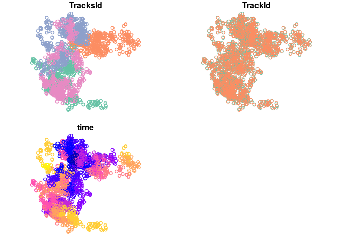
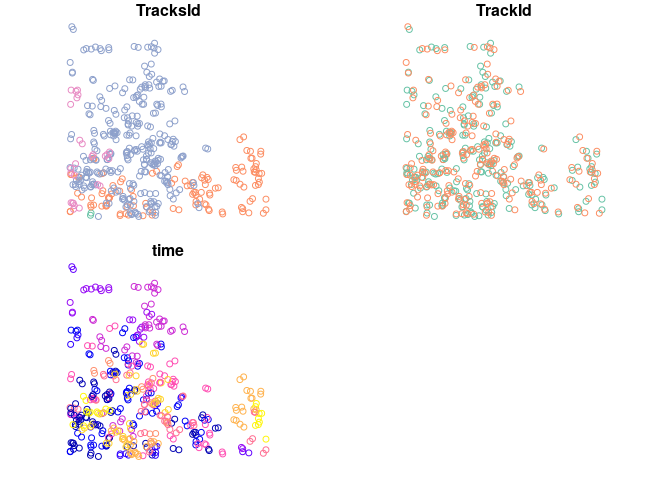

Notes on design of trajectory class based on the sf package
================

Here I gather some Ideas how a trajectory class based on sf could look like. This is based on the discussions with many others.

nested tibbles
==============

Frequently trajectories are grouped on two levels. Where one entity (animal, car) migh have been tracked multiple times either simultaniously by multiple sensors (GPS, Argos, direct observation). This corresponds to `trajectories::Tracks` consisting of `trajectories::Track`. Then multiple tracked entities could gathered into a collection of tracks. For example `trajectories::Tracks` grouped in `trajectories::TracksCollection` or `move::Move` grouped in `move::MoveStack`. One idea to capture this structure would be use nested tibbles, the advantage of this setup is that it is rather easy to capture auxilary information (e.g. sex of individuals, car model, properties of the observation sensor). This could look something like this where 4 tracks are simulated, each track has been observeed twice with a location error.

``` r
require(sf)
```

    ## Loading required package: sf

    ## Linking to GEOS 3.6.2, GDAL 2.2.3, PROJ 4.9.3

``` r
dataSf <- do.call('rbind', replicate(4, {
  n <- round(rgamma(1, 400))
  # simulate brownian motion
  df <-
    data.frame(
      TracksId = paste(sample(letters), collapse = ''),
      time = Sys.time() + 1:n,
      x = cumsum(rnorm(n)),
      y = cumsum(rnorm(n))
    )
  # observe the track twice with a location error
  withErr <- replicate(2, {
    dfWithError <- df
    dfWithError$x <- df$x + rnorm(nrow(df), sd = .1)
    dfWithError$y <- df$y + rnorm(nrow(df), sd = .1)
    dfWithError
  }, simplify = F)
  rbind(cbind(withErr[[1]], TrackId = 'tr1'),
        cbind(withErr[[2]], TrackId = 'tr2'))
}, simplify = F)) %>%
  st_as_sf(coords = c('x', 'y'), crs = 28992)
suppressMessages(require(tibble))
suppressMessages(require(tidyr))
suppressMessages(require(dplyr))
suppressMessages(require(purrr))
trajAsNestedTibble <-
  dataSf %>% 
  as_tibble() %>% 
  nest(-TracksId,-TrackId, .key='Track') %>% 
  mutate(Track = map(Track, ~st_as_sf(.x))) %>% nest(-TracksId, .key='Tracks')
trajAsNestedTibble
```

    ## # A tibble: 4 x 2
    ##   TracksId                   Tracks          
    ##   <fct>                      <list>          
    ## 1 bueqvjythxwalgzmncodfkspir <tibble [2 × 2]>
    ## 2 nilarfkxpmsyoegzcqjvbwhutd <tibble [2 × 2]>
    ## 3 izpthqxmfebndjvrukloawsycg <tibble [2 × 2]>
    ## 4 rymvghtsdxfjwequpczlanikbo <tibble [2 × 2]>

``` r
trajAsNestedTibble$Tracks[[1]]
```

    ## # A tibble: 2 x 2
    ##   TrackId Track             
    ##   <fct>   <list>            
    ## 1 tr1     <tibble [415 × 2]>
    ## 2 tr2     <tibble [415 × 2]>

``` r
trajAsNestedTibble$Tracks[[1]]$Track[[1]] %>% head()
```

    ## Simple feature collection with 6 features and 1 field
    ## geometry type:  POINT
    ## dimension:      XY
    ## bbox:           xmin: 0.4335085 ymin: -3.365161 xmax: 1.213213 ymax: -1.39285
    ## epsg (SRID):    28992
    ## proj4string:    +proj=sterea +lat_0=52.15616055555555 +lon_0=5.38763888888889 +k=0.9999079 +x_0=155000 +y_0=463000 +ellps=bessel +towgs84=565.2369,50.0087,465.658,-0.406857,0.350733,-1.87035,4.0812 +units=m +no_defs
    ## # A tibble: 6 x 2
    ##   time                             geometry
    ##   <dttm>                        <POINT [m]>
    ## 1 2019-03-13 14:42:06   (0.518603 -1.39285)
    ## 2 2019-03-13 14:42:07 (0.6133364 -1.623702)
    ## 3 2019-03-13 14:42:08   (1.213213 -2.16036)
    ## 4 2019-03-13 14:42:09 (0.4335085 -3.365161)
    ## 5 2019-03-13 14:42:10  (1.011515 -2.561027)
    ## 6 2019-03-13 14:42:11  (0.9773563 -2.63912)

``` r
suppressWarnings(trajAsNestedTibble %>% unnest %>% unnest %>% st_as_sf %>% plot)
```



One disadvantage of this structure is that it might note nessicarily obvious for users how to access all information.

sf and nested tibbles
=====================

`sf` does not work directly with nested tibbles. This means some usage of map is required

``` r
# polygon to intersect
subRegion<-st_sfc(st_polygon(list(cbind(c(10,0,0,10,10),
                                        c(10,10,0,0,10)))),
                  crs = 28992)
# this does not work
try(st_intersection(trajAsNestedTibble, subRegion))
```

    ## Error in UseMethod("st_intersection") : 
    ##   no applicable method for 'st_intersection' applied to an object of class "c('tbl_df', 'tbl', 'data.frame')"

``` r
# this works 
suppressWarnings(
  trajIntersect<-trajAsNestedTibble %>% 
    mutate(Tracks=map(Tracks, ~.x%>%  
                        mutate(Track = map(Track, 
                                           ~st_intersection(.x, subRegion))))))

suppressWarnings(plot(trajIntersect %>% unnest %>% unnest %>%st_as_sf))
```



Time data
=========

This is probably one of the main challenges. The clearest was to deal with this is probably to define a column like the `geometry` column of a Simple features collection. This is probably most easily defined based on the POSIXct.

Printing
========

To some extent printing can be inproved by improving the `tibble` printing function by defining `type_sum` functions usw (see <https://cran.r-project.org/web/packages/tibble/vignettes/extending.html>). This is easily done when class are implements. The bigger question is if and how to implement global summaries of track objects like the way `sf` prints bounding boxes and projections.

Asserting properties of trajectory
==================================

The usage of nested tibbles allows for a lot of freedom and there are not many restrictions. For example, each track could have its own projection, this might even be useful in some cases where one would prefer a locally flat projection for each track. But many algorithms require some assumption (e.g. regular in time, flat projection, ordered in time usw, no duplicate time). I think the preferable setup would be not to restict the class very much but rather let other function assert that the input if valid for specific algorithms. The `assertthat` package could be of help here in combination with a set of validation functions. Examples could be:

-   `is_regular_in_time`
-   `is_regular_in_space`, equal distance between observations
-   `is_longlat`
-   `has_no_duplicated_times`
-   `has_z`

I think a few properties might be formally restricted as they are quite common among most tracking data I am aware of. The two that I directly imagine would be first that timestamps are ordered. Second might be that only `sf::POINT` as spatial features are considered. I am not 100% sure of the later one as I can see some value for other possible spatial features like `sf::MULTIPOINT` (for example for argos tracking data that has two alternative solutions) or maybe have the locations presented as error polygons instead of points.
